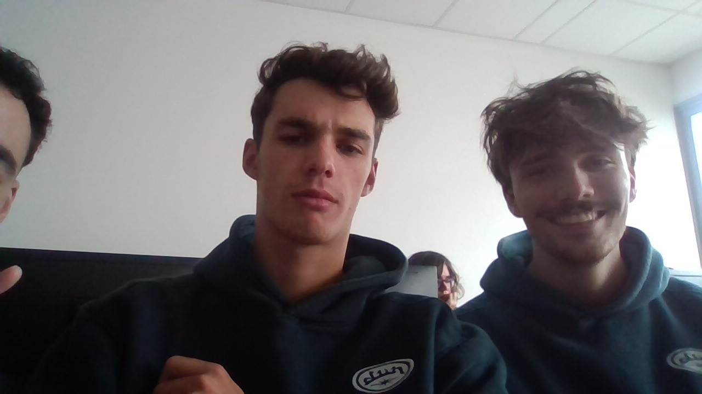

# 4A ILIA PROJET NIOM

Projet de 4ème année d'école d'ingénieur de Polytech Dijon par [Nicolas Métais](https://github.com/nicopyright) et [Tom Dunand](https://github.com/Tom-D04). 

## Statuts actions

